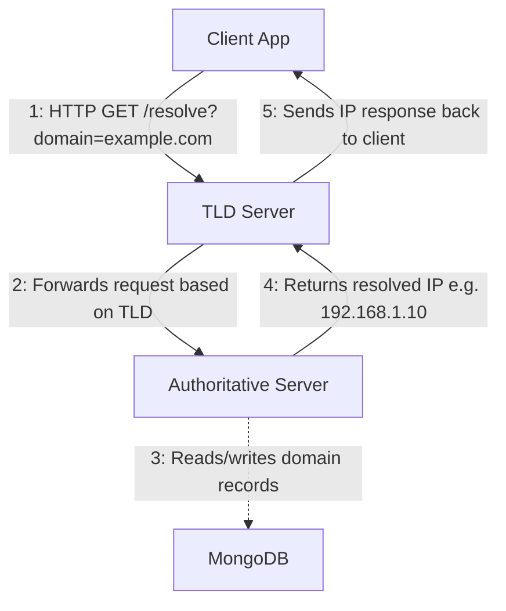

# Mini DNS resolver

This repository holds a couple different services that together make a mini dns resolver. 

## Overview

## Setup
In order to run the projects:
1. Clone the project
2. Open one of the server's in a dedicated terminal
3. Do a poetry install in this folder to create your venv
4. Switch to the venv and run the app.py

5. Once you have all three services running, you can use the system by interacting with the client (so go to that application window in your terminal)
6. You should be able to resolve 'example.com' and 'test.com'