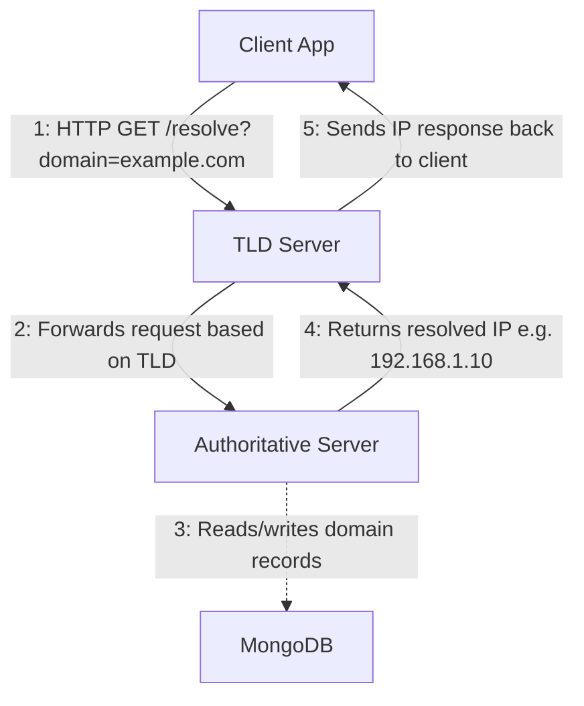

# Mini DNS resolver

This repository holds a couple different services that together make a mini dns resolver. 

## Overview

```mermaid
graph TD
    A[Client App] -->|1: HTTP GET /resolve?domain=example.com| B[TLD Server]
    B -->|2: Forwards request based on TLD| C[Authoritative Server ]
    C -->|4: Returns resolved IP e.g. 192.168.1.10| B
    B -->|5: Sends IP response back to client| A

    %% Optional MongoDB integration
    C -.->|3: Reads/writes domain records| D[MongoDB]
    %% B -.->|Optional: caches results| D
```
